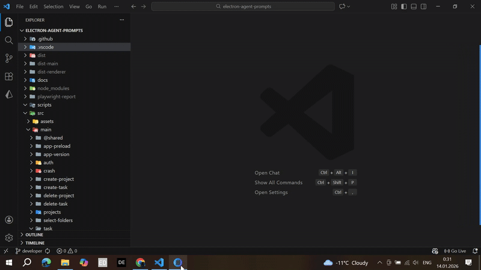

# Agent Prompts

**Agent Prompts** is a desktop application, designed to streamline the management of AI agent instructions. It provides a structured environment for organizing prompts into projects and tasks, while allowing to inject rich context from local files, markdown documents.

---

## What is it useful for?

In the rapidly evolving landscape of AI development, managing complex prompts often requires significant manual effort—especially when those prompts need to be grounded in specific local source code or architectural documentation. **Agent Prompts** simplifies this by:

- **Organizing Research & development**: Group related prompts into projects.
- **Context Management**: Easily attach local folder contents or specific files to provide the AI with the necessary background for better responses.
- **Standardizing Instruction sets**: Maintain a library of structured markdown documents (prompts) that include code snippets and architectural diagrams.
- **Workflow Efficiency**: Quick access to tasks and projects via a dedicated desktop interface with global availability through the system tray.

---

## Core Functionality

### 🚀 Project & Task Management

- **Hierarchical Organization**: Create and manage projects containing multiple specific tasks.
- **Full CRUD Support**: Create, update, and delete projects and tasks with real-time UI synchronization.
- **Data Persistence**: State is managed via a dedicated REST API with local caching for improved performance.

### 📁 Context Injection & File Handling

- **Local Folder Integration**: Select local directories to provide their file structure and contents as context for tasks.
- **File Uploads**: Support for uploading and managing files related to specific tasks.
- **Markdown Processing**: Specialized parser for markdown documents that handles standard text, code fences, and custom `architecture` blocks.

### 🔐 Secure Authentication

- **Social Login**: Integration with popular providers including **GitHub** and **Google**.
- **Session Persistence**: Secure token management for continuous access.

### 🖥️ Native Desktop Features

- **Auto-Updater**: Seamless updates via GitHub Releases integration.
- **System Tray**: Keep the application running in the background for quick access.
- **Native Notifications**: Real-time status updates for long-running tasks or updates.
- **Light/Dark Mode**: Customizable UI theme according to system preferences or user choice.

---

## 🤖 Advanced AI Integration (Agent Skills & Custom Instructions)

**Agent Prompts** adapts to the latest industry standards for AI customization, specifically targeting **GitHub Copilot** workflows in VS Code. It allows you to transform your tasks and prompts directly into actionable instructions within any folder you select on your local machine.

### Key Benefits

- **Multi-Project Synchronization**: Update a single instruction or task and have it automatically pushed to all associated project folders simultaneously.
- **Context-Aware Discovery**: The application automatically traverses folder hierarchies to find relevant configuration files (like `.git` or `.vscode/settings.json`).

When you associate local folders with a task, the application offers two powerful ways to inject context into those specific directories:

### 1. VS Code Custom Instructions (`settings.json`)

Inject project-specific coding standards and guidelines directly into the `.vscode/settings.json` of the selected folder.

- **Mechanism**: Automatically discovers the `.vscode` directory within the selected path (or its parents) and updates the `github.copilot.chat.codeGeneration.instructions` array.
- **Use Case**: Defining coding conventions, framework-specific rules, or architectural patterns that should always be applied within the project scope.

### 2. Agent Skills (`.github/skills/`)

Create portable, task-specific capabilities using the **Agent Skills** open standard within the selected workspace.

- **Mechanism**: Detects the Git root of the selected folder and creates a dedicated skill directory: `.github/skills/[task-name]/SKILL.md`.
- **Use Case**: Teaching Copilot specialized workflows, complex procedures, or providing detailed examples that are loaded on-demand based on your prompt description.
- **Benefits**: Portable across VS Code, Copilot CLI, and Copilot coding agents, adhering to the standard defined at [agentskills.io](https://agentskills.io/).

---

## Tech Stack

- **Framework**: Electron (Main & Renderer process)
- **Frontend**: React, Material UI (MUI), Vite, React Router
- **Language**: TypeScript (Strict typing across both processes)
- **State & Storage**: React Context, Electron-Store, REST API integration
- **Testing**: Playwright (E2E), Jest (Unit testing for Main and Renderer)
- **Styling**: Theme-driven CSS-in-JS (MUI `sx` prop and `styled` components)
